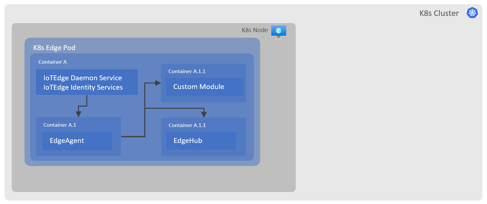

# KEdge

Kubernetes based IoT Edge deployment.
This repo demonstrates an experimental deployment of IoT Edge runtime 1.2 on K8s.

## Steps to deploy

1. Authenticate and connect to existing K8s cluster.
2. Update config.toml with your device connection string.
3. Build docker container image.
4. Deploy docker image as a pod in K8s using kedgedeployment.yaml.

Following diagram depicts the way in which edge runtime is hosted in K8s:

[Add explanation of each step and caveats]